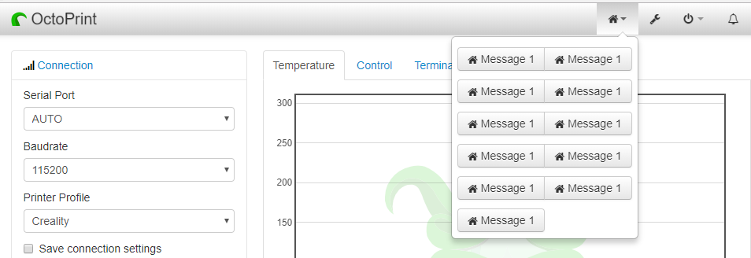

# OctoPrint-MQTTPublish

This plugin adds a menu to the navbar of OctoPrint to send configured MQTT messages to the MQTT server configured in the [MQTT Plugin](https://plugins.octoprint.org/plugins/mqtt/).

## Prerequisites

Install the [MQTT](https://github.com/OctoPrint/OctoPrint-MQTT) plugin via the Plugin Manager or manually using this url:

	https://github.com/OctoPrint/OctoPrint-MQTT/archive/master.zip

## Setup

Install via the Plugin Manager or manually using this URL:

    https://github.com/jneilliii/OctoPrint-MQTTPublish/archive/master.zip

## Configuration

Once the MQTT plugin and this plugin are installed, configure the MQTT plugin for connecting to your MQTT server.  Then in this plugin's settings configure the topics/commands you want to publish to that server.

## Settings

- Topics
  - Topic: topic to publish message to.
  - Message: message to send to topic.
  - Label: label to display on menu.
  - Icon: icon class name from [fontawesome](http://fontawesome.io/3.2.1/cheatsheet/) to show on button.
  - Confirm: show a confirmation prompt on sending message.
- General
  - Menu Icon: icon class name from [fontawesome](http://fontawesome.io/3.2.1/cheatsheet/) to show in navbar.
  - Menu Button Grouping: Group buttons by this many and then start a new row in dropdown menu.

