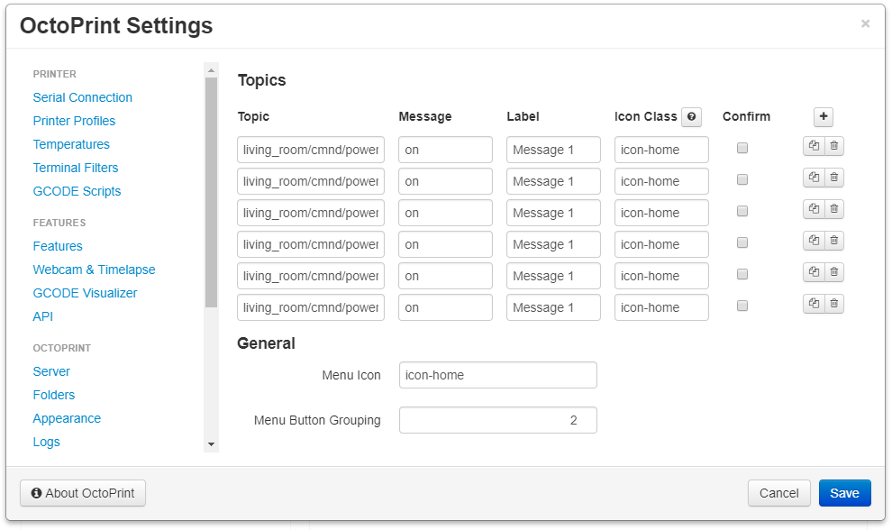
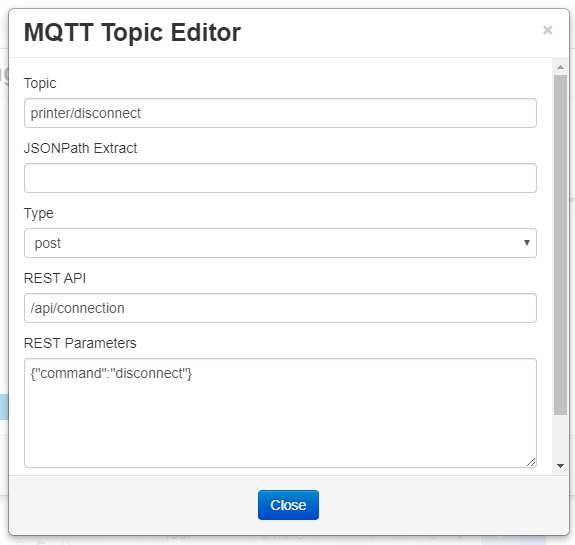

# MQTT Subscribe

This plugin can control OctoPrint by submitting commands to the [OctoPrint REST API](http://docs.octoprint.org/en/master/api/index.html).

## Prerequisites

Install the [MQTT](https://github.com/OctoPrint/OctoPrint-MQTT) plugin via the Plugin Manager or manually using this url:

	https://github.com/OctoPrint/OctoPrint-MQTT/archive/master.zip

Once installed configure the MQTT server connection in the MQTT plugin's settings. This will be the same server that the MQTT Subscribe plugin will connect to for subscribing configured topics.

## Setup

Install via the Plugin Manager or manually using this URL:

    https://github.com/jneilliii/OctoPrint-MQTTSubscribe/archive/master.zip

## Configuration

Once both plugins are installed configure the topics/commands you want to subscribe/submit to and generate your API key.

## Settings

### Topics
- List of configured topics
  - Click the plus button in the top right to add new topics
  - Click the pencil button to edit a configured topic
  - Click the copy button to duplicate a topic
  - Click the trash icon to delete a topic
### General
- API Key: API key to use to authenticate to the [OctoPrint REST API](http://docs.octoprint.org/en/master/api/index.html)
  - Click the plus button to generate your API key and accept the request
  - Click the trash icon to clear your API key
  - Click the copy button to copy the API key to your clipboard

## MQTT Topic Editor

- Topic: MQTT topic to subscribe
- JSONPath Extract: JSON Path expression to extract from sent data, see [here](https://github.com/jneilliii/OctoPrint-MQTTSubscribe/issues/7#issuecomment-582166178) for an example, leave blank if substitution is not necessary in the `REST Parameters` described below
- Type: The type of REST API submission, either post or get
- REST API: The [OctoPrint REST API](http://docs.octoprint.org/en/master/api/index.html) command that you want to submit
- REST Parameters: The `JSON parameters` to submit to the REST API configured above. Due to the token replacement options used for JSONPath extraction place a space after the first `{` and before the last `}`. For example `{ "command": "connect" }` or put the opening and closing curly brackets on their own line.

## Most Recent Release

**[0.1.6](https://github.com/jneilliii/OctoPrint-MQTTSubscribe/releases/tag/0.1.6)** (11/21/2020)

**Added**

* release channels for OctoPrint 1.5.0+ for future rc testing, similar to OctoPrint as described [here](https://community.octoprint.org/t/how-to-use-the-release-channels-to-help-test-release-candidates/402)

**Updated**

* knockout sortable library for OctoPrint 1.5.0 compatibility

### [All Releases](https://github.com/jneilliii/OctoPrint-MQTTSubscribe/releases)

## Get Help

If you experience issues with this plugin or need assistance please use the issue tracker by clicking issues above.

### Additional Plugins

Check out my other plugins [here](https://plugins.octoprint.org/by_author/#jneilliii)

### Sponsors
- Andreas Lindermayr
- [@Mearman](https://github.com/Mearman)
- [@TheTuxKeeper](https://github.com/thetuxkeeper)
- [@tideline3d](https://github.com/tideline3d/)
- [SimplyPrint](https://simplyprint.dk/)
- [Andrew Beeman](https://github.com/Kiendeleo)
- [Calanish](https://github.com/calanish)
- [Will O](https://github.com/4wrxb)
- [Lachlan Bell](https://lachy.io/)
- [Johnny Bergdal](https://github.com/bergdahl)
- [Leigh Johnson](https://github.com/leigh-johnson)
- [Stephen Berry](https://github.com/berrystephenw)
- [Guyot François](https://github.com/iFrostizz)
- César Romero
- [Steve Dougherty](https://github.com/Thynix)
- [Kyle Menigoz](https://menigoz.me)
## Support My Efforts
I, jneilliii, programmed this plugin for fun and do my best effort to support those that have issues with it, please return the favor and leave me a tip or become a Patron if you find this plugin helpful and want me to continue future development.

 

<small>No paypal.me? Send funds via PayPal to jneilliii&#64;gmail&#46;com</small>
