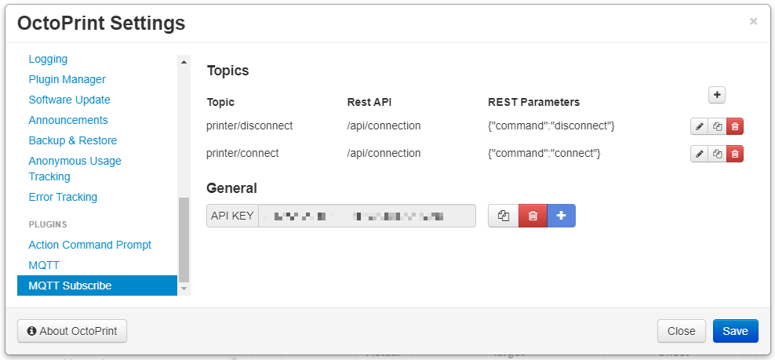

# OctoPrint-MQTTSubscribe

This plugin will subscribe to configured topics published to the server configured in [MQTT Plugin](https://plugins.octoprint.org/plugins/mqtt/) and will subscribe to configured topics and relay those commands to the OctoPrint REST API.

## Prerequisites

Install the [MQTT](https://github.com/OctoPrint/OctoPrint-MQTT) plugin via the Plugin Manager or manually using this url:

	https://github.com/OctoPrint/OctoPrint-MQTT/archive/master.zip

## Setup

Install via the Plugin Manager or manually using this URL:

    https://github.com/jneilliii/OctoPrint-MQTTSubscribe/archive/master.zip

## Configuration

Once the MQTT plugin and this plugin are installed, configure the MQTT plugin for connecting to your MQTT server.  Then in this plugin's settings configure the topics/commands you want to subscribe to and your user API Key.

To send a command to OctoPrint publish to the MQTT topic `/octoprint/plugins/mqttsubscribe/<topic>` the json string equivalent to the REST API required for the command. The results of the REST API response will be published back to `/octoprint/plugins/mqttsubscribe/<topic>/status` and `/octoprint/plugins/mqttsubscribe/<topic>/response`. See settings screenshot below for a simple example of getting the current connection status and a disconnect command.

## Settings

- Topics
  - Topic: topic to subscribe to. Should be the same as base OctoPrint REST API path, ie if API is [/api/connection](http://docs.octoprint.org/en/master/api/connection.html#get--api-connection) you use `connection`.
  - Type: type of API method (post or get)
  - Message: message to monitor for. Should be the same json string to submit to the [OctoPrint REST API](http://docs.octoprint.org/en/master/api/index.html).
- General
  - API Key: User's API key to use to authenticate to the OctoPrint REST API.

## Support My Efforts
I programmed this plugin for fun and do my best effort to support those that have issues with it, please return the favor and support me.

